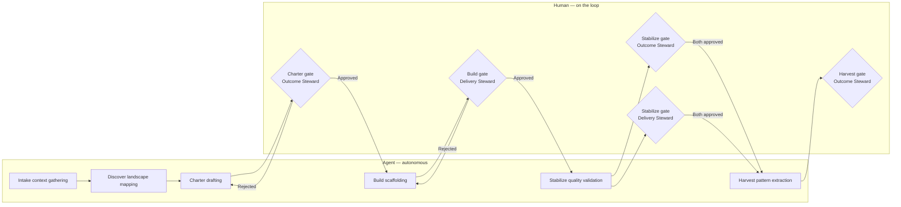
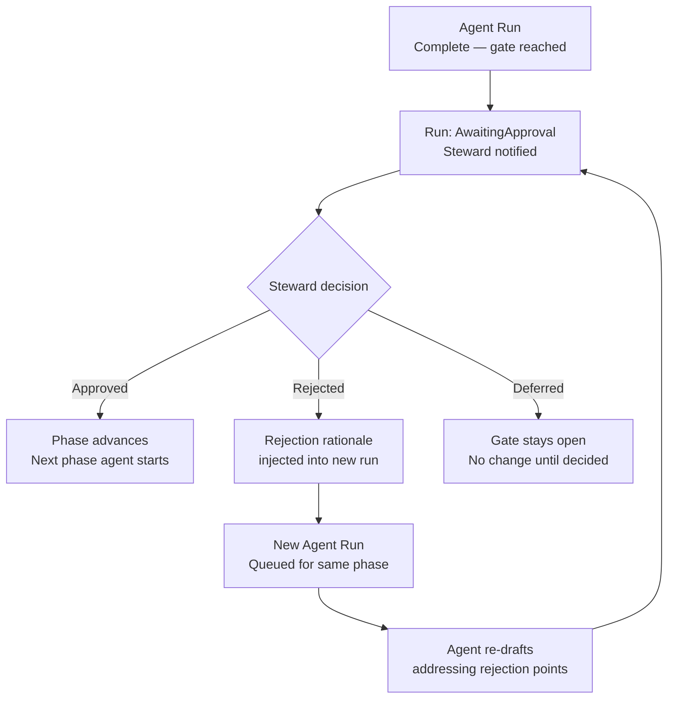
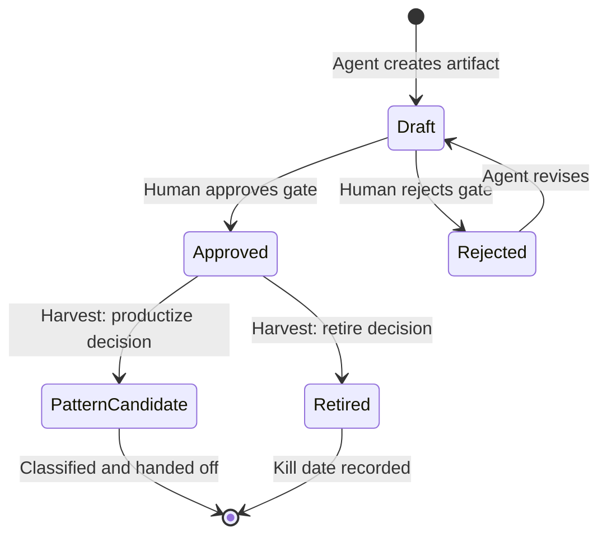

# FDE SDLC Process Guide — Inception to Delivery

> **Audience:** Product Managers, Forward Deployed Engineers, and engagement leads.  
> **Purpose:** A complete narrative of how an FDE engagement progresses from the moment it is created to final delivery, pattern harvest, and close — including what agents do, what humans decide, what artifacts are produced, and what "done" means at every stage.  
> **Technical reference:** [`docs/sdlc-agentic-process.md`](sdlc-agentic-process.md)

---

## How to read this guide

The process has **six phases**. In every phase, an autonomous agent does the work. Humans are **on the loop** — notified when a decision is needed, presented with the agent's output, and asked to approve, reject, or defer. Nothing production-impacting happens without a recorded human decision.

The two human roles in this process are **capability-based**, not job titles:

| Capability | Concern | Who might hold it |
|-----------|---------|-------------------|
| **Outcome Steward** | Customer outcomes, commercial commitments, priorities, productization | Product Manager, engagement lead, account owner |
| **Delivery Steward** | Technical evidence, artifact quality, integration soundness, harvest classification | Forward Deployed Engineer, technical lead |

One person can hold both capabilities. The system routes gate notifications by capability, not by name.

---

## Full process at a glance

```mermaid
flowchart TD
  subgraph trigger [Before the process]
    T1[Customer need identified\nengagement scoped]
    T2[Engagement created\nin SDLC application]
  end

  subgraph intake [Phase 1 — Intake\nAutomatic]
    P1A[Agent gathers account context\nenvironment constraints\nexternal system signals]
    P1B[Intake Summary artifact produced]
  end

  subgraph discover [Phase 2 — Discover\nAutomatic]
    P2A[Agent maps stakeholders\ntechnical landscape\nintegration dependencies\ninitial risks]
    P2B[Technical Landscape Map\nInitial Risk Register produced]
  end

  subgraph charter [Phase 3 — Charter\nHuman Gate — Outcome]
    P3A[Agent drafts charter:\nproblem statement\nsuccess criteria\nuse cases\nconstraints]
    P3G{Outcome Steward\nreviews and decides}
    P3R[Charter Approved\nor agent re-drafts]
  end

  subgraph build [Phase 4 — Build\nHuman Gate — Delivery]
    P4A[Agent scaffolds delivery artifacts:\nconfigurations\nintegration specs\ndocumentation\nchecklist fills]
    P4G{Delivery Steward\nreviews and decides}
    P4R[Artifacts Approved\nor agent revises]
  end

  subgraph stabilize [Phase 5 — Stabilize\nHuman Gate — Both]
    P5A[Agent validates quality:\nartifact assessment\nrisk rescan\ngo-live readiness report]
    P5G{Outcome Steward\nAND Delivery Steward\nboth decide}
    P5R[Go-live Approved\nor stabilize continues]
  end

  subgraph harvest [Phase 6 — Harvest\nHuman Gate — Outcome]
    P6A[Agent extracts patterns:\nclassifies artifacts\ndrafts productization candidates\nlessons learned]
    P6G{Outcome Steward\nclassifies patterns}
    P6R[Patterns Productized\nor Retired]
  end

  subgraph close [Engagement Complete]
    C1[Delivery confirmed\nArtifacts handed over\nMetrics recorded]
  end

  T1 --> T2
  T2 --> P1A
  P1A --> P1B
  P1B --> P2A
  P2A --> P2B
  P2B --> P3A
  P3A --> P3G
  P3G -->|Approved| P4A
  P3G -->|Rejected| P3A
  P4A --> P4G
  P4G -->|Approved| P5A
  P4G -->|Rejected| P4A
  P5A --> P5G
  P5G -->|Approved| P6A
  P5G -->|Deferred| P5A
  P6A --> P6G
  P6G --> P6R
  P6R --> C1
```

---

## Swim-lane view: agent work vs human decisions

---

## Phase 0 — Inception (before the system)

**What triggers an engagement:**
An FDE engagement begins outside the application — typically when a customer need is scoped, a Statement of Work or equivalent agreement is in place, and an FDE or PM has enough information to open the engagement record.

**What you need before creating an engagement:**
- Customer/account name
- A brief description of the problem or opportunity (2–3 sentences)
- Planned start date and target delivery date
- Assignees: who is the Outcome Steward, who is the Delivery Steward (or both the same person for smaller engagements)

**What you do:**
Open the SDLC application → Engagement List → **New Engagement**. Fill in account name, description, dates, and assignees. Submit.

**What happens next:**
The system creates an `Engagement` record, sets the current phase to **Intake**, and automatically starts the first agent run. You do not need to trigger anything manually.

---

## Phase 1 — Intake

**Who acts:** Context Agent (HelixGPT Skill: `FDE-Intake-Context`)  
**Human gate:** None — auto-advances to Discover on completion  
**Duration:** Minutes (depends on the volume of external data available)

### What the agent does

The Context Agent reads every piece of information it can find about this engagement without asking any questions:

- Reads the `Engagement` record fields (account name, description, dates, assignees)
- Searches existing Helix records for any prior engagement history with this account
- Calls configured Integration Endpoints — CRM, account management systems — to pull account tier, contract information, and prior interactions (read-only; no writes)
- Identifies what is known, what is missing, and what is ambiguous

### What the agent produces

| Artifact | Description |
|---------|-------------|
| **Intake Summary** | Structured Markdown document: account overview, engagement scope summary, known stakeholders, identified gaps, recommended focus areas for Discover |

### What humans do in this phase

**Nothing required.** The agent works autonomously. Humans can open the Agent Workspace and watch the agent's progress in real time via the `rx-helix-gpt-chat` interface, or ask it questions: "What have you found so far?" or "What's still unknown?"

### What "done" looks like

The Intake Summary artifact exists in `Draft` status. The agent has written its Phase Context Bundle (the structured handoff to the next phase). The engagement automatically advances to Discover.

### Entry criteria

- Engagement record created with account name, description, and at least one assignee

### Exit criteria (automatic)

- Intake Summary artifact created
- Phase Context Bundle written to the Agent Run record

---

## Phase 2 — Discover

**Who acts:** Context Agent (HelixGPT Skill: `FDE-Discover-Context`)  
**Human gate:** None — auto-advances to Charter on completion  
**Duration:** Minutes to hours (depends on external integration response times)

### What the agent does

Building on the Intake Summary, the Context Agent goes deeper:

- Loads the Intake Summary from Phase 1
- Expands the stakeholder map with roles, influence levels, and decision authority
- Identifies all technical integration points, dependencies, and third-party systems
- Enumerates known and likely risks — technical (platform gaps, data issues), commercial (scope, timeline), and organisational (stakeholder alignment, approvals)
- Calls Git/CI Integration Endpoints if configured, to scan repository signals and pipeline health
- Identifies platform capability gaps relevant to the use cases

Every inference is marked `[INFERRED]`; every confirmed fact is marked `[CONFIRMED]`.

### What the agent produces

| Artifact | Description |
|---------|-------------|
| **Technical Landscape Map** | Integration points, dependencies, platform capabilities used or needed; data classification notes; key constraints |
| **Initial Risk Register** | Itemised risks with likelihood (`High/Medium/Low`), impact, and suggested owner — seeded as Risk records in the system |

### What humans do in this phase

**Nothing required.** Humans can review the Technical Landscape Map as it builds in the Agent Workspace. This is a good time for the Delivery Steward to validate the agent's technical understanding: "Is the Salesforce integration correct?" or "Have you checked the data classification requirements?"

### What "done" looks like

Technical Landscape Map and Initial Risk Register artifacts exist. Risk records have been created in the system. The agent has written a rich Phase Context Bundle carrying all findings forward.

### Entry criteria

- Phase 1 complete; Intake Summary artifact available

### Exit criteria (automatic)

- Technical Landscape Map artifact created
- Initial Risk Register artifact created; individual risk records seeded
- Phase Context Bundle written

---

## Phase 3 — Charter

**Who acts:** Craft Agent (HelixGPT Skill: `FDE-Charter-Craft`)  
**Human gate:** **Outcome gate** — Outcome Steward must approve  
**Duration:** Agent works in minutes; human review typically same-day

### What the agent does

The Craft Agent reads all prior phase context and drafts the customer charter:

- Problem statement (2–3 sentences, customer language, no technical jargon)
- Success criteria — measurable outcomes, not a list of deliverables
- Constraints and non-negotiables (technical, compliance, commercial, organisational)
- Prioritised use cases — top 3 maximum for v1
- Assumptions requiring customer confirmation
- Recommended timeline phasing (relative, not absolute dates)

Every statement traces to a fact from Intake or Discover. Unsupported assumptions are explicitly flagged as `[ASSUMPTION: reason]`.

After creating the charter, the agent signals that it is ready for review and the run transitions to `AwaitingApproval`.

### What the agent produces

| Artifact | Description |
|---------|-------------|
| **Charter** | Full charter document in Markdown; structured sections; traceable to prior phase findings |

### What humans do in this phase

The **Outcome Steward** receives a notification and opens the Control Tower. They see:

- The charter document summary
- An `outcome` capability badge on the pending gate
- Three actions: **Approve**, **Reject**, **Defer**

**If Approved:** The Outcome Steward confirms the charter accurately reflects the agreed scope and priorities. They provide a brief rationale (required). The engagement advances to Build.

**If Rejected:** The Outcome Steward explains what is wrong — scope is too broad, success criteria are not measurable, wrong problem statement, etc. The rejection rationale is fed directly into the next agent run as context. The agent re-drafts.

**If Deferred:** The gate stays open. No phase change. Use this when the Outcome Steward needs to consult the customer before deciding.

### What "done" looks like

Charter artifact approved. Both stewards have a shared, written agreement on what the engagement is trying to achieve before any build work begins.

### Entry criteria

- Phase 2 complete; Technical Landscape Map and Risk Register available
- Outcome Steward assigned (can respond to `outcome` gates)

### Exit criteria (human-gated)

- Charter artifact created by agent
- Outcome Steward has submitted an `Approved` decision with rationale
- No open `[ASSUMPTION]` items that have not been acknowledged

### Common rejection reasons

- Success criteria are activity-based, not outcome-based ("deliver integration" vs "reduce ticket resolution time by 30%")
- Problem statement uses internal product language the customer wouldn't recognise
- More than 3 use cases in scope for v1
- Critical customer constraint not captured (e.g. no cloud egress, SOC2 requirement)

---

## Phase 4 — Build

**Who acts:** Craft Agent (HelixGPT Skill: `FDE-Build-Craft`)  
**Human gate:** **Delivery gate** — Delivery Steward must approve  
**Duration:** Agent produces scaffolds in minutes to hours; human review typically 1–2 days

### What the agent does

With the approved charter as its anchor, the Craft Agent produces delivery artifacts:

- **Implementation scaffold** — configuration stubs, integration specifications, or code structure matched to the approved use cases; format depends on what the Technical Landscape Map identified
- **Updated Risk Register** — reviews existing risks (marks any resolved by charter decisions), adds new risks identified during scaffolding
- **Checklist fills** — pre-fills Build phase checklists with agent-suggested responses (all marked `Agent-suggested`, requiring human confirmation)

Each artifact references the charter use case it addresses and explicitly notes any blockers or customer dependencies.

If this is a **re-run following rejection**, the agent's initial message includes the rejection rationale and the agent addresses those points specifically before producing new artifacts.

After all artifacts are created, the agent signals readiness and transitions to `AwaitingApproval`.

### What the agent produces

| Artifact | Type | Description |
|---------|------|-------------|
| **Implementation Scaffold(s)** | `scaffold` | Configuration stubs, integration specs, or code structure per use case |
| **Updated Risk Register** | `risk-register` | Prior risks reviewed + new risks from Build phase |
| **Filled Checklist** | (checklist items) | Build-phase checklist items pre-filled as `Agent-suggested` |

### What humans do in this phase

The **Delivery Steward** receives a notification and opens the Control Tower. They see:

- A summary of each artifact produced (title, type, version, linked use case)
- A `delivery` capability badge on the pending gate
- Three actions: **Approve**, **Reject**, **Defer**
- Clicking **Approve** or **Reject** opens a review modal showing the artifact content (or diff from prior version) and a rationale field

The Delivery Steward evaluates:
- Does the scaffold actually address the approved use cases?
- Are integration specs technically sound given the constraints?
- Are checklist items reasonably filled, or are the agent's suggestions wrong?
- Are there new blockers in the updated risk register that need resolution before Build continues?

**If Approved:** Artifacts are promoted from `Draft` to `Approved` status. The engagement advances to Stabilize.

**If Rejected:** The Delivery Steward explains what needs to change. The rejection rationale is injected into the next agent run. The agent revises.

**If Deferred:** Gate stays open. Use this when the Delivery Steward needs to validate a specific technical assumption with the customer or platform team before approving.

### What "done" looks like

All Build artifacts approved and in `Approved` status. The Delivery Steward has confirmed that the scaffolding represents a sound foundation for the engagement to proceed to production readiness.

### Entry criteria

- Charter approved and in place
- Delivery Steward assigned (can respond to `delivery` gates)

### Exit criteria (human-gated)

- At least one `scaffold` or `integration-spec` artifact created and approved
- Updated Risk Register artifact created and approved
- Delivery Steward has submitted an `Approved` decision with rationale

### Common rejection reasons

- Scaffold does not match the use cases in the charter (wrong integration approach, missing a use case)
- Integration spec contains assumptions that contradict the Technical Landscape Map constraints
- Risk Register has new high-severity risks that need a conversation before proceeding
- Checklist items are incorrectly filled and would mislead the team

---

## Phase 5 — Stabilize

**Who acts:** Validate Agent (HelixGPT Skill: `FDE-Stabilize-Validate`)  
**Human gate:** **Both capabilities** — Outcome Steward AND Delivery Steward must independently approve  
**Duration:** Agent validation in minutes to hours; human review typically 1–3 days

### What the agent does

The Validate Agent acts as an independent quality assessor:

- Lists all approved Build artifacts and reads each one
- Evaluates each artifact against the charter's success criteria — pass/fail with evidence
- Runs all configured Diagnostic Rules against the engagement state (e.g. "Does the risk register have any unresolved blockers?", "Are all use cases addressed by at least one artifact?")
- Re-reads the Risk Register — assesses whether any open risks have become blockers since Build
- Produces a Go-Live Readiness Report with a clear recommendation: **Ready**, **Conditional** (with a list of conditions), or **Not Ready**

### What the agent produces

| Artifact | Description |
|---------|-------------|
| **Go-Live Readiness Report** | Artifact-by-artifact quality assessment; diagnostic rule results; open risk classification (Blocker / High / Manageable); go-live recommendation with conditions if applicable |

### What humans do in this phase

**Both stewards** must independently respond. The `both` gate stays open until both have submitted a decision.

The **Outcome Steward** reviews the readiness report through a customer outcomes lens:
- Do the artifacts collectively achieve the success criteria in the charter?
- Are there open commercial or organisational risks that should block go-live?
- Is the customer ready (UAT complete, sign-off obtained, stakeholders aligned)?

The **Delivery Steward** reviews through a technical quality lens:
- Are the diagnostic rule results acceptable?
- Is every integration point verified or at least explicitly risk-accepted?
- Is the deployment checklist complete enough to hand over confidently?

**If both approve:** Engagement advances to Harvest.  
**If either defers:** Gate stays open. Use defer when waiting for customer sign-off or final UAT results.  
**If either rejects:** A new Validate Agent run is triggered (incorporating both rationales). Consider whether a Build re-run is needed first.

### What "done" looks like

Go-Live Readiness Report approved by both stewards. The engagement is confirmed ready for production deployment or customer handover. **This is the formal delivery confirmation point.**

### Entry criteria

- All Build artifacts in `Approved` status
- No unresolved `Blocker`-severity risks from the Risk Register
- Both stewards assigned

### Exit criteria (human-gated — both required)

- Go-Live Readiness Report produced
- Outcome Steward: `Approved` decision with rationale
- Delivery Steward: `Approved` decision with rationale
- Recommendation in report is `Ready` or `Conditional` with all conditions accepted by the approving stewards

### Common deferral/rejection reasons

- Customer UAT not yet complete
- Open security review or data classification approval pending
- Platform dependency not deployed to production environment
- A use case from the charter is missing from the artifact set (build gap)
- Diagnostic rules showing unacceptable failure rates

---

## Phase 6 — Harvest

**Who acts:** Craft Agent (HelixGPT Skill: `FDE-Harvest-Craft`)  
**Human gate:** **Outcome gate** — Outcome Steward classifies patterns  
**Duration:** Agent works in minutes; human classification typically same-day

### What the agent does

The Craft Agent reviews the full artifact set from the engagement and identifies what should outlive it:

For each significant artifact, the agent classifies:
- **Reusable Pattern** — the structural problem it solves is general enough to apply to other engagements; the agent drafts a generalised description (not the specific solution)
- **Account-Specific** — valuable for this customer but not generalisable; no further action
- **Retire** — bespoke code or configuration that should be sunset; agent proposes a kill date

For Reusable Patterns, the agent produces a **Pattern Candidate** artifact: generalised description, applicability to other engagements, estimated effort to standardise, recommended owner (platform team or FDE knowledge base).

The agent also produces a **Harvest Summary**: all pattern candidates, retirement recommendations, and 3–5 key lessons learned from the engagement.

### What the agent produces

| Artifact | Description |
|---------|-------------|
| **Pattern Candidate(s)** | One per generalised pattern; describes the structural problem, not the specific solution |
| **Harvest Summary** | All patterns, retirements, lessons learned; the institutional memory of the engagement |

### What humans do in this phase

The **Outcome Steward** reviews each Pattern Candidate and classifies it:

- **Productize** — this pattern should enter the platform roadmap or FDE knowledge base; assign to product team
- **Retire** — not worth generalising; confirm kill date for the specific artifact
- **Hold** — interesting but not yet ready to commit; schedule a review date

The engagement is already delivered at this point (Stabilize gate passed). Harvest is the learning loop — it feeds back into future engagements and product roadmap, not into this delivery.

### What "done" looks like

- All Pattern Candidates classified
- Retirement decisions recorded with kill dates
- Harvest Summary in `Approved` status
- Engagement status set to `Complete`

### Entry criteria

- Stabilize gate passed; delivery confirmed
- Engagement in `Approved` status with both stewards' sign-off

### Exit criteria (human-gated)

- Harvest Summary created and approved
- Each Pattern Candidate classified (Productize / Retire / Hold)
- Kill dates set on retiring artifacts

---

## Engagement complete — what delivery means

An FDE engagement is **delivered** when the Stabilize gate has been approved by both stewards. That is the formal, recorded delivery confirmation — not when the Harvest phase completes (Harvest is post-delivery learning).

### Delivery confirmation record

At Stabilize gate approval, the system records:
- `Engagement.status = Complete`
- The `Human Decision` records from both stewards (immutable; auditable)
- `phase_exited_ms` for the Stabilize phase (used in BI export for delivery velocity calculations)
- A `Metric Snapshot` for the engagement's phase-exit timestamp vs `Engagement.targetDeliveryMs` (on-time / late / early)

### What the customer sees (external metrics)

If an external stakeholder dashboard is connected to the BI export, they see:
- Phase progression (which phase the engagement is in)
- Delivery date vs target date
- Number of approved artifacts
- Gate completion status (without exposing internal rationale)

These are drawn from `GET /sdlc/metrics/export` — a stable, versioned flat-schema endpoint consumable by any BI or reporting tool.

---

## Exception paths

### Gate rejected — what happens

**Key behaviours:**
- Rejection never loses prior work. All artifacts remain in the system in `Draft` or `Rejected` status. The agent starts from the prior Phase Context Bundle, not from scratch.
- The rejection rationale becomes the first message in the new agent run: *"The previous draft was rejected. Reason: {rationale}. Please revise."*
- There is no limit on rejection cycles. If an engagement is repeatedly rejected, the system records this — it becomes visible in the Metrics Dashboard as high approval cycle time, which is a diagnostic signal.

### Agent run fails — what happens

If an agent run fails (provider error, timeout, or exceeds iteration limit):
- The run is marked `Failed`
- Any partial `Draft` artifacts remain — they are not deleted
- The human can retry via `POST /sdlc/engagements/{id}/runs`
- The new run picks up the prior Phase Context Bundle so context is not lost

### Engagement put on hold

If an engagement needs to pause (customer pause, internal priority change):
- Set `Engagement.status = OnHold`
- Active agent runs can be cancelled via the Control Tower
- The engagement can be resumed by setting status back to `Active`; the next agent run will load the prior Phase Context Bundle

### Scope change after Charter approval

If scope changes significantly after the Charter gate:
- A new Charter gate can be triggered by starting a new agent run in the Charter phase (the Outcome Steward can request this from the Control Tower)
- The agent re-drafts the charter incorporating the scope change
- Both the original and new Human Decision records are preserved in the audit trail

---

## What the human interface shows at each phase

| Phase | Control Tower shows | Agent Workspace shows | What the human does |
|-------|--------------------|-----------------------|---------------------|
| Intake | Phase strip at step 1; agent status: Running | Chat: agent gathering context; event feed | Watch; ask questions (optional) |
| Discover | Phase strip at step 2; agent status: Running | Chat: agent mapping landscape; risks being created | Watch; validate technical understanding (optional) |
| Charter | Phase strip at step 3; **Outcome gate pending**; agent status: AwaitingApproval | Charter artifact summary; prior context | **Approve / Reject / Defer** |
| Build | Phase strip at step 4; **Delivery gate pending** | Artifact summaries; diff from prior if revision | **Approve / Reject / Defer** |
| Stabilize | Phase strip at step 5; **Both-capability gate pending** | Readiness report; diagnostic results | **Both stewards decide independently** |
| Harvest | Phase strip at step 6; **Outcome gate pending** | Pattern candidates; harvest summary | **Classify each pattern** |
| Complete | All steps complete | Harvest Summary approved | Nothing required |

---

## Process metrics: how we measure engagement health

These are tracked automatically and visible in the Metrics Dashboard:

| Metric | What it measures | Signal |
|--------|-----------------|--------|
| **Phase velocity** | Time spent in each phase | Slow Build = complexity or unclear scope; slow Charter = misaligned stakeholders |
| **Approval cycle time** | Time from agent completing a run to human deciding at a gate | Long cycle times = stewards not available or decision is unclear |
| **Gate rejection rate** | How often agents are rejected at each gate | High Charter rejections = scope definition problem; high Build rejections = technical approach problem |
| **Agent cost per phase** | Normalized LLM cost per engagement phase | Unusually high cost = very large context or runaway iterations |
| **Agent success rate** | Ratio of `Complete` to `Complete + Failed` runs | Low success rate = provider reliability issue or prompt configuration problem |
| **On-time delivery** | `Stabilize gate approved` vs `Engagement.targetDeliveryMs` | Red if late; used for BI/leadership reporting |

---

## Artifact lifecycle summary

All artifacts are retained permanently. `Rejected` artifacts are never deleted — they form part of the audit trail and the learning substrate for future engagements.

---

## Quick reference: who does what

| Action | Who | When | How |
|--------|-----|------|-----|
| Create engagement | Any authenticated user | Inception | Engagement List → New Engagement |
| Watch agent progress | Any | Any phase | Agent Workspace → `rx-helix-gpt-chat` |
| Ask the agent questions | Any | Any phase | Agent Workspace → type in chat |
| Approve/Reject/Defer Charter | **Outcome Steward** | Phase 3 gate | Control Tower → gate card |
| Approve/Reject/Defer Build | **Delivery Steward** | Phase 4 gate | Control Tower → gate card |
| Approve/Reject/Defer Go-Live | **Both stewards** | Phase 5 gate | Control Tower → gate card (each independently) |
| Classify harvest patterns | **Outcome Steward** | Phase 6 gate | Control Tower → gate card |
| Cancel an agent run | Any | Any running phase | Agent Workspace → Cancel button |
| Retry a failed run | Any | After failure | Control Tower → Retry / Engagement List |
| Put engagement on hold | Any | Any phase | Engagement record → status OnHold |
| Export metrics to BI | Admin / leadership | Any time | Metrics Dashboard → Export button |

---

*This document is the human-readable process reference. For the full technical specification — data model, REST API, Java services, HelixGPT Skill configurations, and BI export schema — see [`docs/sdlc-agentic-process.md`](sdlc-agentic-process.md).*
